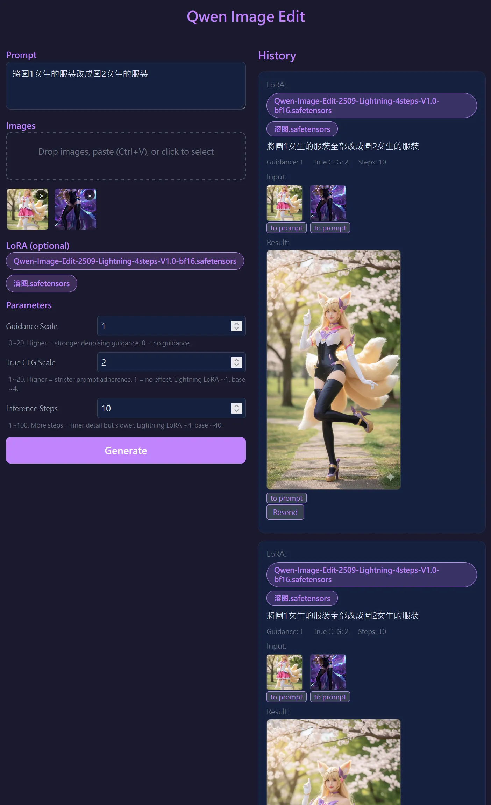
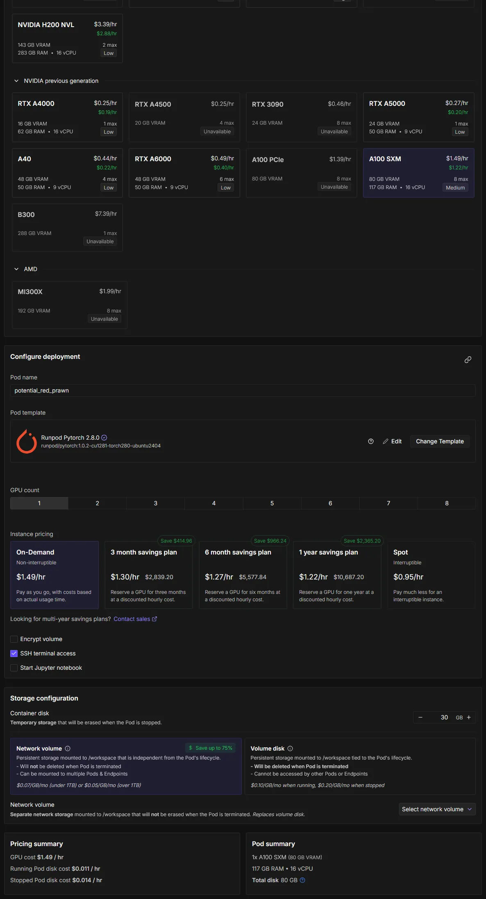

# `qwen-image-2509`預計部署到[RunPod](https://www.runpod.io/)



## 準備
- 這僅僅是測試使用、**非常不安全**
- 支援SSH之電腦(windows之git bash就有了)
- 登入[RunPod](https://www.runpod.io/)並儲值，最少10USD
- 用完記得關掉、不然很貴
- 預計使用`A100-80GB(大概1.49USD/hr)`
- 第一次部署大概要下載10分鐘、啟動10分鐘


### 產生`SSH key`（若已有可跳過）
```bash
ssh-keygen -t ed25519 -C "runpod" -f ~/.ssh/id_ed25519 -N ""
cat ~/.ssh/id_ed25519.pub
```

### 配置`SSH key`給runpod
至[https://console.runpod.io/user/settings](https://console.runpod.io/user/settings)
將`public key`全部貼到`SSH Public Key` 欄位(全部)


# 部署

## 左邊[pods](https://console.runpod.io/deploy)、準備新建



- 低標`A100-80GB(大概1.49USD/hr)`
- 使用template`Runpod Pytorch 2.8.0`(預裝 torch 2.8 + CUDA 12.8)
- 打勾`SSH terminal access`
- 關掉`Start Jupyter notebook`
- `Container disk`可以想成C槽安裝程式所用，預設的`30GB`就好
- 使用`Network volume`當隨身碟、至少`75GB`、不然重開模型又要下載很久，測完也要記得[刪除](https://console.runpod.io/user/storage)，預設掛在容器的`/workspace`
- 第一次部署大概要下載10分鐘、啟動10分鐘
- 用完記得關掉

> `Network volume`第一次要新建
> 

## pod啟動後
- 至[console](https://console.runpod.io/deploy)
- 點一下該pod
- 先`SSH: Connect to your Pod using SSH. (No support for SCP & SFTP)`或`Connect to your Pod using SSH over a direct TCP connection. (Supports SCP & SFTP)`，就輸入那串指令
- 進到容器


## 首次部署
```bash
export HF_HOME=/workspace/huggingface_cache
cd /workspace
git clone https://github.com/nicetw20xx/qwen-image-edit-web.git
```

### 容器第一次執行
```
export HF_HOME=/workspace/huggingface_cache && cd /workspace/qwen-image-edit-web && git pull && pip install --ignore-installed -r requirements.txt -c constraints.txt && python server.py 8888
```

### git更新
```
export HF_HOME=/workspace/huggingface_cache && cd /workspace/qwen-image-edit-web && git pull && python server.py 8888
```

第一次部署大概要下載10分鐘、啟動10分鐘

## 服務啟動後
- 至[console](https://console.runpod.io/deploy)
- 點一下該pod
- 點Port 8888-`Jupyter Lab`，如果程式完成就可以看到網頁了


# 功能

## 後端
- 使用[https://huggingface.co/Qwen/Qwen-Image-Edit-2509](https://huggingface.co/Qwen/Qwen-Image-Edit-2509)
- 支援lora: 使用者提供huggingface的URL，取其檔名
- 輸入為`提示詞、[圖]、[lora](選填)`
- 該api輸入後會排隊，超過10個429
- 輸出檔名unix-ms的圖片、然後也存在後端
- 開一個靜態網頁當前端

## 前端html+vue3.js+純js不打包
### 左邊輸入
- 提示詞
- 圖片：可以拉、可以ctrl+V、可以拖拉他們順序、可以點擊開預覽100%
- lora可選擇
- 按下後打api，丟去下面歷史列表(網頁關掉就沒了)

### 歷史列表
- `提示詞`、`[圖]`、`[lora名子]`、結果：生成的圖、或錯誤訊息或generating
- 所有圖可以點擊開預覽100%、下方有按鈕`to prompt`
- 可以`Resend`

